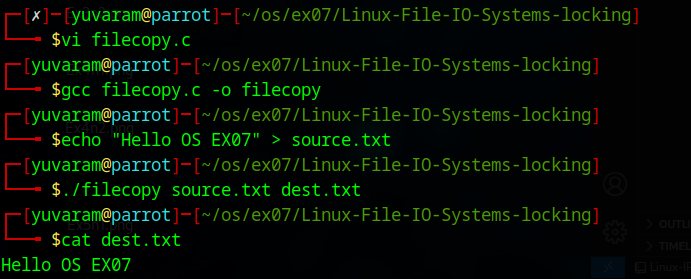
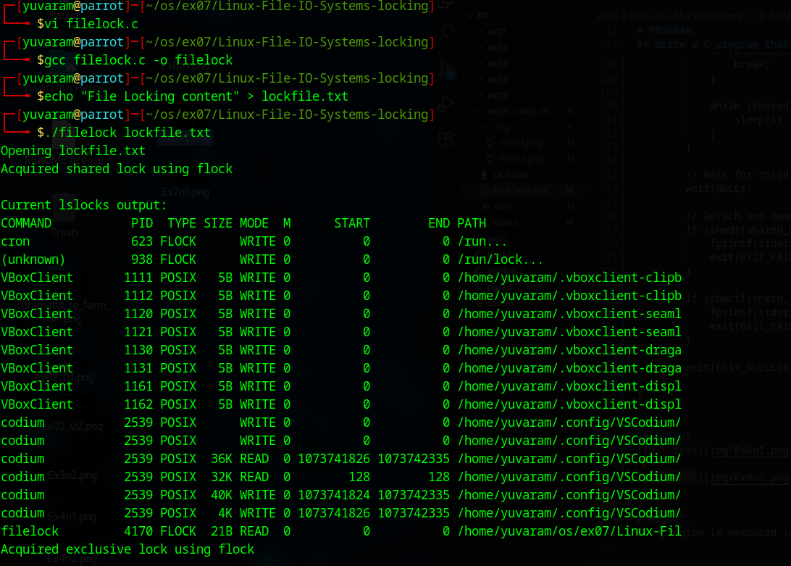
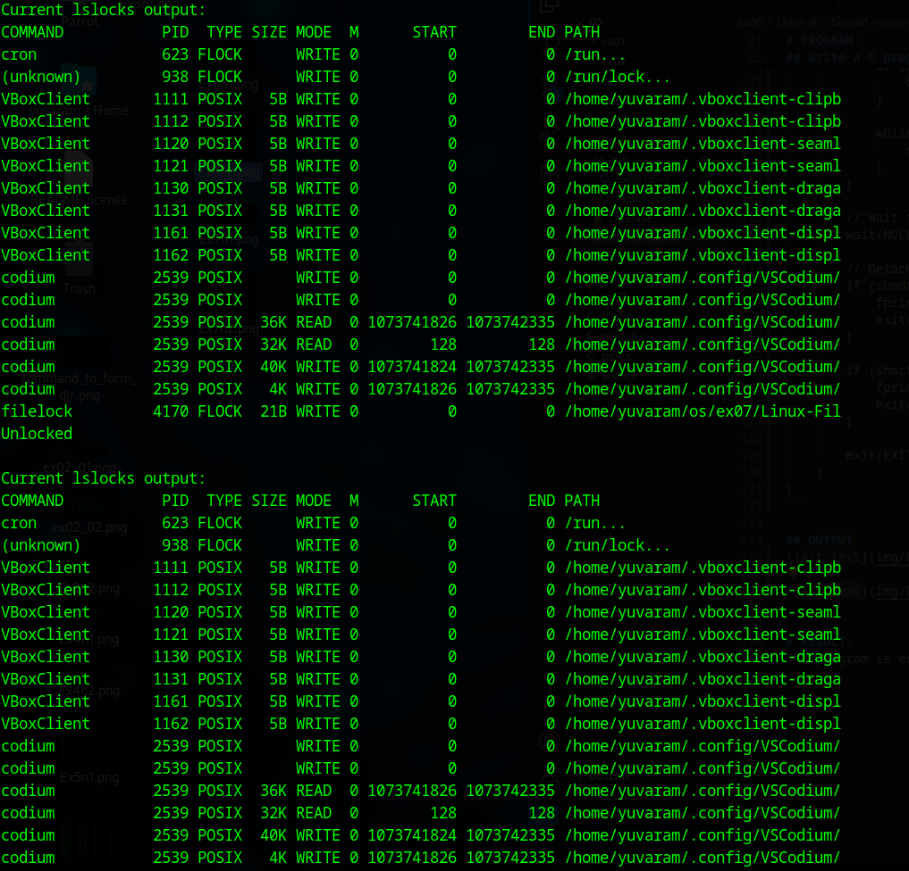

# Linux-File-IO-Systems-locking
Ex07-Linux File-IO Systems-locking
# AIM:
To Write a C program that illustrates files copying and locking

# DESIGN STEPS:

### Step 1:

Navigate to any Linux environment installed on the system or installed inside a virtual environment like virtual box/vmware or online linux JSLinux (https://bellard.org/jslinux/vm.html?url=alpine-x86.cfg&mem=192) or docker.

### Step 2:

Write the C Program using Linux IO Systems locking

### Step 3:

Execute the C Program for the desired output. 

# PROGRAM:

## 1.To Write a C program that illustrates files copying 
```
#include <unistd.h>
#include <sys/stat.h>
#include <fcntl.h>
#include <stdlib.h>
#include <stdio.h>

int main(int argc, char *argv[]) {
    if (argc != 3) {
        fprintf(stderr, "Usage: %s <source_file> <destination_file>\n", argv[0]);
        exit(EXIT_FAILURE);
    }

    char block[1024];
    int in, out;
    ssize_t nread;

    in = open(argv[1], O_RDONLY);
    if (in == -1) {
        perror("Error opening source file");
        exit(EXIT_FAILURE);
    }

    out = open(argv[2], O_WRONLY | O_CREAT | O_TRUNC, S_IRUSR | S_IWUSR);
    if (out == -1) {
        perror("Error opening destination file");
        close(in);
        exit(EXIT_FAILURE);
    }

    while ((nread = read(in, block, sizeof(block))) > 0) {
        if (write(out, block, nread) != nread) {
            perror("Error writing to destination file");
            close(in);
            close(out);
            exit(EXIT_FAILURE);
        }
    }

    if (nread == -1) {
        perror("Error reading source file");
    }

    close(in);
    close(out);
    return EXIT_SUCCESS;
}
```

## OUTPUT



## 2.To Write a C program that illustrates files locking
```
#include <fcntl.h>
#include <stdio.h>
#include <stdlib.h>
#include <unistd.h>
#include <sys/file.h>

void display_lslocks() {
    printf("\nCurrent lslocks output:\n");
    fflush(stdout);
    system("lslocks");
}

int main(int argc, char *argv[]) {
    if (argc < 2) {
        fprintf(stderr, "Usage: %s <filename>\n", argv[0]);
        exit(EXIT_FAILURE);
    }

    char *file = argv[1];
    int fd;

    printf("Opening %s\n", file);

    fd = open(file, O_WRONLY);
    if (fd == -1) {
        perror("Error opening file");
        exit(EXIT_FAILURE);
    }

    if (flock(fd, LOCK_SH) == -1) {
        perror("Error acquiring shared lock");
        close(fd);
        exit(EXIT_FAILURE);
    }
    printf("Acquired shared lock using flock\n");
    display_lslocks();

    sleep(1); // Simulate waiting before upgrading

    if (flock(fd, LOCK_EX | LOCK_NB) == -1) {
        perror("Error upgrading to exclusive lock");
        flock(fd, LOCK_UN); // Release shared lock if upgrade fails
        close(fd);
        exit(EXIT_FAILURE);
    }
    printf("Acquired exclusive lock using flock\n");
    display_lslocks();

    sleep(1); // Simulate waiting before unlocking

    if (flock(fd, LOCK_UN) == -1) {
        perror("Error unlocking");
        close(fd);
        exit(EXIT_FAILURE);
    }
    printf("Unlocked\n");
    display_lslocks();

    close(fd);
    return 0;
}
```


## OUTPUT




# RESULT:
The programs are executed successfully.
